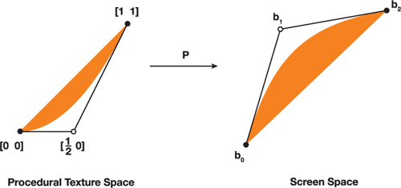
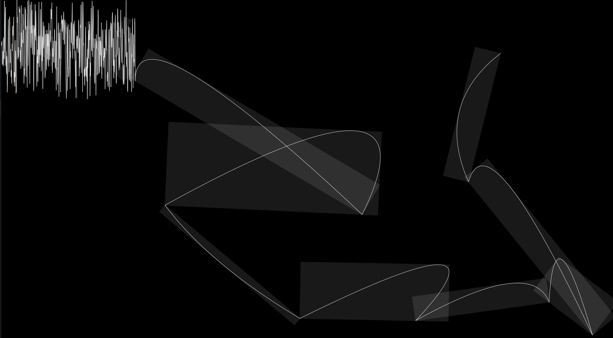

+++
title = "Rendering bezier strokes with SDFs"
date = 2020-12-13
+++

[Demo](https://pum-purum-pum-pum.github.io/bezier/)
[src](https://github.com/pum-purum-pum-pum/beziers)

### Why SDFs

The idea is to avoid triangulating the curve. There are already methods like
[Loop-Blinn](https://developer.nvidia.com/gpugems/gpugems3/part-iv-image-effects/chapter-25-rendering-vector-art-gpu).

[picture reference](https://developer.nvidia.com/gpugems/gpugems3/part-iv-image-effects/chapter-25-rendering-vector-art-gpu)

But unfortunately, these methods can't be easily
extended for strokes in general case since the
offset curve of for example quadratic bezier curve
is not quadratic Bezier curve (it is polynomial of 6 degree).
It could be easily seen for Bezier curve with
extreme sharp angle (with extreme inflection).
There are methods for approximating these curves
near inflection points with smaller bezier curves but it
requires some effort to implement such algorithms.
If we just want to render bezier strokes --
SDF seems to be the most simple way to do this.
Also, it gives local antialiasing for free.

### Plan

Consider quadratic Bezier curves.
The idea is the same as for [rendering lines](https://vladjuckov.github.io/hqlines/).
There are some differences, however:

1) We use bezier SDF and hence we should pass all parameters
for quadratic bezier curve in our shader --
start/end point and control point.
2) We should find a bounding box for each Bezier curve we render.

The result should look like this:


In this article, we'll not bother about what happens
when curves overlap even at end points,
The last issue was discussed in the previous
article about
[rendering lines](https://vladjuckov.github.io/hqlines/).

The fragment shader is quite straightforward:

```C
# version 310 es
precision highp float;
// start point
in vec2 af;
// control point
in vec2 controlf;
// end point
in vec2 cf;
// current position in fragment shader
in vec2 posf;
// thickness of the curve
in float thicknessf;

out vec4 FragColor;

float dot2( in vec2 v ) { return dot(v,v); }

// borrowed from here https://www.iquilezles.org/www/articles/distfunctions2d/distfunctions2d.htm
float sdBezier( in vec2 pos, in vec2 A, in vec2 B, in vec2 C )
{
    vec2 a = B - A;
    vec2 b = A - 2.0*B + C;
    vec2 c = a * 2.0;
    vec2 d = A - pos;
    float kk = 1.0/dot(b,b);
    float kx = kk * dot(a,b);
    float ky = kk * (2.0*dot(a,a)+dot(d,b)) / 3.0;
    float kz = kk * dot(d,a);
    float res = 0.0;
    float p = ky - kx*kx;
    float p3 = p*p*p;
    float q = kx*(2.0*kx*kx-3.0*ky) + kz;
    float h = q*q + 4.0*p3;
    if( h >= 0.0)
    {
        h = sqrt(h);
        vec2 x = (vec2(h,-h)-q)/2.0;
        vec2 uv = sign(x)*pow(abs(x), vec2(1.0/3.0));
        float t = clamp( uv.x+uv.y-kx, 0.0, 1.0 );
        res = dot2(d + (c + b*t)*t);
    }
    else
    {
        float z = sqrt(-p);
        float v = acos( q/(p*z*2.0) ) / 3.0;
        float m = cos(v);
        float n = sin(v)*1.732050808;
        vec3  t = clamp(vec3(m+m,-n-m,n-m)*z-kx,0.0,1.0);
        res = min( dot2(d+(c+b*t.x)*t.x),
                   dot2(d+(c+b*t.y)*t.y) );
        // the third root cannot be the closest
        // res = min(res,dot2(d+(c+b*t.z)*t.z));
    }
    return sqrt( res );
}

void main() {
    vec4 color = vec4(1., 1., 1., 1.); // we can also make it as input attribute
    float d = sdBezier(posf, af, controlf, cf) - thicknessf;
    // bigger value -- more blury
    float smooth_amount = 1.;
    float s = smoothstep(0., smooth_amount, -d);
    if (d < 0.) {
        color.a = s;
    } else {
        discard;
    }
    FragColor = color;
}
```

I didn't do anything to support
the camera as it was with lines.
It could be easily added if you want.

Let's address the second problem we have
-- finding proper bounding boxes.
Here is the Rust code for doing this:

```Rust
/// basically rotation matrix (f.e. see here https://matthew-brett.github.io/teaching/rotation_2d.html)
///
pub fn rot(point: Vec2, cosb: f32, sinb: f32) -> Vec2 {
    vec2(
        cosb * point.x - sinb * point.y,
        sinb * point.x + cosb * point.y,
    )
}

/// oriented are betwee two vectors (by definition det(|v1^T \n v2^T|))
/// or more importantly for us: |v1| |v2| sin (alpha)
pub fn wedge(v1: Vec2, v2: Vec2) -> f32 {
    v1.x * v2.y - v1.y * v2.x
}

#[derive(Copy, Clone, Debug, PartialEq)]
#[repr(C)]
pub struct QuadCurve {
    pub a: Vec2,
    pub control: Vec2,
    pub c: Vec2,
}

/// basically https://www.iquilezles.org/www/articles/bezierbbox/bezierbbox.htm
/// with extra rotation
fn optimal_bb(&self, width: f32) -> (Vec2, Vec2, Vec2, Vec2) {
    let dir = self.c - self.a;
    let ndir = dir.normalize();
    let ox = vec2(1., 0.);
    let sinb = wedge(ndir, ox);
    let cosb = (self.c - self.a).normalize().dot(ox);
    // align with Ox axis
    let p0 = self.a; // start point stays the same
    let p0p1 = self.control - self.a;
    let p1 = p0 + rot(p0p1, cosb, sinb); // control points rotates
    let p2 = p0 + vec2(dir.length(), 0.); // end point is parralel to X axis

    // calculation inflection point in this coordinates
    // (see original article for explanation)
    let mut mi = p0.min(p2);
    let mut ma = p0.max(p2);
    if p1.x < mi.x || p1.x > ma.x || p1.y < mi.y || p1.y > ma.y {
        let t = (p0 - p1) / (p0 - 2. * p1 + p2);
        let t = vec2(clamp(t.x), clamp(t.y));
        let s = vec2(1., 1.) - t;
        let q = s * s * p0 + 2.0 * s * t * p1 + t * t * p2;
        mi = mi.min(q);
        ma = ma.max(q);
    }
    let (mi, ma) = bounding_box_frame(mi, ma, width);
    // now align back with bezier
    // We simply rotate negative to previous angle: cos(-a) = cos(a), sin(-a) = -sin(a)
    let ma_rotated = p0 + rot(ma - p0, cosb, -sinb);
    let mi_rotated = p0 + rot(mi - p0, cosb, -sinb);
    let offset = ndir.dot(mi_rotated - ma_rotated) * ndir;
    let b = ma_rotated + offset;
    let d = mi_rotated - offset;
    (mi_rotated, b, ma_rotated, d)
}
```

It first rotates Bezier curve so that the line which
connects the start and end points of the curve is parallel to X-axis.
Then it calculates the extreme point(inflection point)
of that curve and hence bounding box in a current rotated coordinate system.
After that, we simply rotate the bounding box back.

After that, we can simply pass it into the GPU pipeline
(this is for simplicity and demo -- could be done in place or via iterator)

```Rust
#[derive(Copy, Clone, Debug, PartialEq)]
#[repr(C)]
pub struct QuadCurve {
    pub a: Vec2,
    pub control: Vec2,
    pub c: Vec2,
}

...
impl QuadCurve {
...
    pub fn vertices(&self, width: f32) -> (Vec<Vertex>, Vec<u16>) {
        let (a, b, c, d) = self.optimal_bb(width);
        let indices = vec![0, 1, 2, 0, 2, 3];
        (
            vec![
                Vertex {
                    position: a,
                    curve: self.clone(),
                    thickness: width,
                },
                Vertex {
                    position: b,
                    curve: self.clone(),
                    thickness: width,
                },
                Vertex {
                    position: c,
                    curve: self.clone(),
                    thickness: width,
                },
                Vertex {
                    position: d,
                    curve: self.clone(),
                    thickness: width,
                },
            ],
            indices,
        )
    }
}

```

### Cubics

For cubics, one can use approximation algorithms and
render quadratic Beziers instead. Se for example
[Quadratic approximation](https://ttnghia.github.io/pdf/QuadraticApproximation.pdf)
