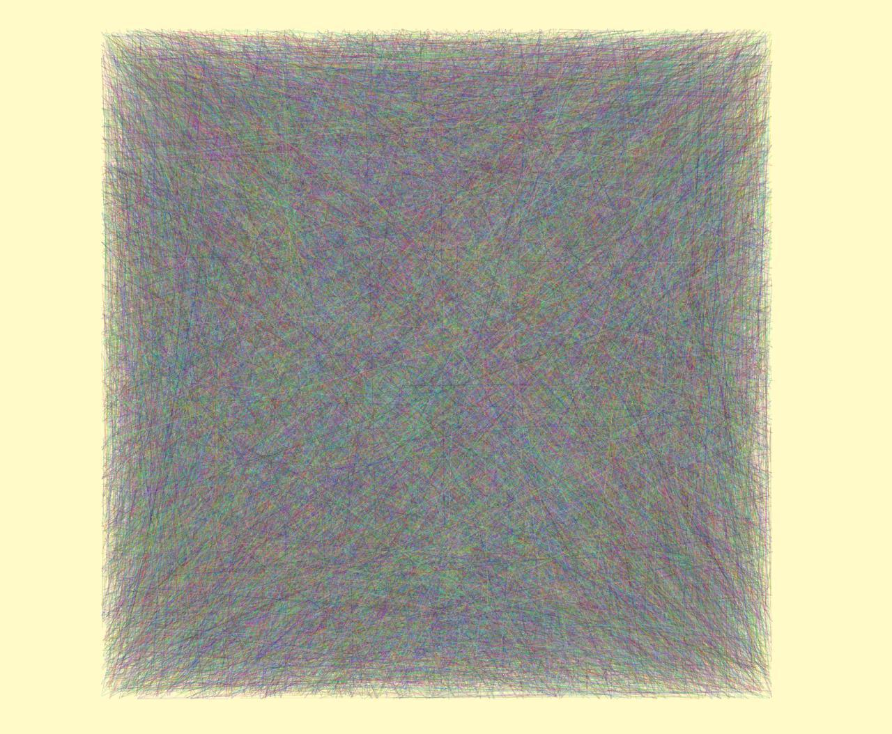
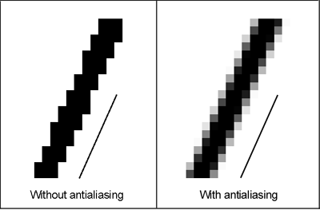
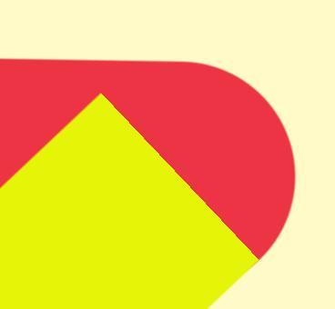
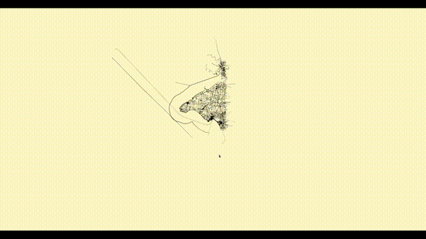

+++
title = "Is it easy to draw a line"
date = 2020-08-26
+++
<!--  -->
### Wait what?
If you just draw rectangle in OpenGL you'll notice that the edges look like a pixel ladder. You may try to fix that with MSAA but it's still poor quality. Also one may want to draw the line not as a rectangle but as a rounded rectangle.

<sub>https://www.displaydaily.com/?view=article&id=102:antialiasing&catid=118:word-of-the-week </sub>

### Normal + width
To draw just rectangle lines one can use normal to a segment as a vertex attribute. This approach is well described [here](https://blog.mapbox.com/drawing-antialiased-lines-with-opengl-8766f34192dc)

### SDF
The other way of drawing high quality segments is using Signed Distance Field (SDF). We can create smooth edges by calculating the distance to it. Also, with SDF we can creating a nice rounded segment's ends.

We also want to draw polygonal chains. Unfortunately, we can't just draw these segments on the top of each other, because of transparent edges that will overlap and create ugly blending effect. Or if the line itself is transparent we will just see overlaps. It can be solved with rendering to texture for example.

We will only consider opaque lines.

[Here](https://www.shadertoy.com/view/Wlfyzl) is the shader we will use for the segment's SDF.

```
float line_segment(in vec2 p, in vec2 a, in vec2 b) {
    vec2 ba = b - a;
    vec2 pa = p - a;
    float h = clamp(dot(pa, ba) / dot(ba, ba), 0., 1.);
    return length(pa - h * ba);
}
...
// later used like
lowp float distance = line_segment(pp, a, b) - thickness;
```

As you can see- in fragment shader we would need segment's ends and thickness. That's why we need to pass these parameters as vertex attributes in the vertex shader and then into fragment shader. There are two ways that come to my head to do this:
1) Create a buffer with two triangles for each line. Just pass SDF parameters in each Vertex.
2) Only create one buffer for a line with two triangles and pass these parameters per line via instancing.

Our line struct will look like this. (segment type is actually discrete value)
```
#[derive(Debug, Clone, Copy)]
#[repr(C)]
pub struct Line {
    pub segment_type: f32,
    pub position: Vec2,
    pub thickness: f32,
    pub dir: Vec2,
    pub color: Vec3,
}

impl Line {
    pub fn new(
        segment_type: SegmentType,
        from: Vec2,
        to: Vec2,
        thickness: f32,
        color: Vec3,
    ) -> Self {
        let dir = to - from;
        Line {
            segment_type: segment_type as u8 as f32, // dirty hack to make OpenGL happy
            position: (from + to) / 2.,
            thickness,
            dir,
            color,
        }
    }
}
```

### Shaders

I'm not sure if the second is faster (since the instance is only two triangles -- it's a small overhead). But it's convenient and fast enough to draw millions of antialiased high-quality lines.

Here is the vertex shader code (sorry for the old glsl version):
```
#version 100
attribute vec2 pos;
attribute float segment_type;
attribute vec2 inst_pos;
attribute float thickness;
attribute vec2 dir;
attribute vec3 color0;

varying lowp vec2 local_position;
varying lowp vec2 projected_position;
varying lowp vec2 ip;
varying lowp float th;
varying lowp vec4 color;
varying lowp float st;
varying lowp vec2 dr;

uniform mat4 mvp;
void main() {
    vec2 n = vec2(-dir.y, dir.x) / length(dir);
    vec2 apos = pos.y * dir + pos.x * n * thickness;
    vec4 new_pos = vec4(apos + inst_pos, 0.0, 1.0);
    lowp vec4 res_pos = mvp * new_pos;
    gl_Position = res_pos;
    
    st = segment_type;
    local_position = pos;
    projected_position = vec2(new_pos.x, new_pos.y);
    ip = inst_pos;
    dr = dir;
    th = thickness;
    color = vec4(color0, 0.5);
}
```
We just change the shape of our line according to parameters: 
* dir -- segment direction
* thickness -- thickness of the line

and then pass required variables into the fragment shader

Here is the fragment shader:
```
#version 100
varying lowp vec2 local_position;
varying lowp vec2 projected_position;
varying lowp vec2 ip;
varying lowp float th;
varying lowp vec4 color;
varying lowp float st;
varying lowp vec2 dr;

uniform highp mat4 mvp;
const lowp float aaborder = 0.00245;

lowp float line_segment(in lowp vec2 p, in lowp vec2 a, in lowp vec2 b) {
    lowp vec2 ba = b - a;
    lowp vec2 pa = p - a;
    lowp float h = clamp(dot(pa, ba) / dot(ba, ba), 0., 1.);
    return length(pa - h * ba);
}

void main() {
    lowp vec2 a = ip - dr  / 2.;
    lowp vec2 b = ip + dr / 2.;
    lowp float d = line_segment(projected_position, a, b) - th ;
    lowp float scaled_border = aaborder / mvp[0][0];
    lowp float edge1 = -scaled_border;
    lowp float edge2 = 0.;

    if (d < 0.) {
        lowp float smooth = 1.;
        if (abs(st - 1.) < 0.01 && local_position.y < -0.5) { // in SDF space
            discard;
        } else if (abs(st - 2.) < 0.01 && local_position.y > 0.5) {
            discard;
        }
        if (d > edge1) {
            smooth = 1. - smoothstep(edge1, edge2, d) + st - st;
        }
        lowp vec4 color = color;
        color.a = smooth;
        gl_FragColor = color;
    } else {
        gl_FragColor = vec4(color.xyz, 0.0);
    }
}
```
First, we do the same operation (create vertex position in world space) as in vertex shader, but without projection with MVP matrix.
Then we calculate the distance to the borders with our line SDF function.
After that, we want to create a nice antialiased edge. We pass the distance smoothstep function between `edge1` and `edge2` and then pass the result value to the alpha channel of the result line's color. 

In order to draw monochromatic polygonal chains with multiple segments we can't just draw segments with corners on the top of each other. Because if we do so then our smooth edges will overlap and blend with each other. Maybe one can solve it with rendering to a texture or some nonstandard blending. But we will just draw only one segment edge as shown in this picture 

(note that each line has a different color only for demonstration. However, we can draw a red line on the top of the yellow.)

We have `segment type` which is a float variable but encodes discrete values (Maybe I'm missing something but it's not clear how to pass int variables, maybe it's just version, haven't tried):

0) Just draw regular segment
1) Cut the first end of the segment
2) Cut the second end of the segment
```
if (abs(st - 1.) < 0.01 && local_position.y < -0.5) { // in SDF space
    discard;
} else if (abs(st - 2.) < 0.01 && local_position.y > 0.5) {
    discard;
}
```
This will produce cutting like a yellow line on the picture.

Our end result will look like this nice monochromatic polygonal lines:


### Bonus: Drawing maps

We can use our lib for example to draw the map. I've provided some OSM data here. We just import all data that can be represented as segments and voila here is the map :)

